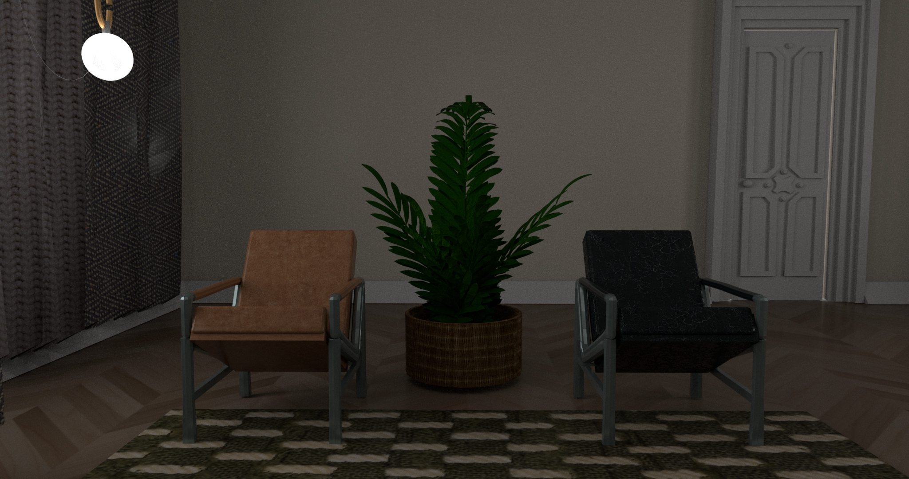
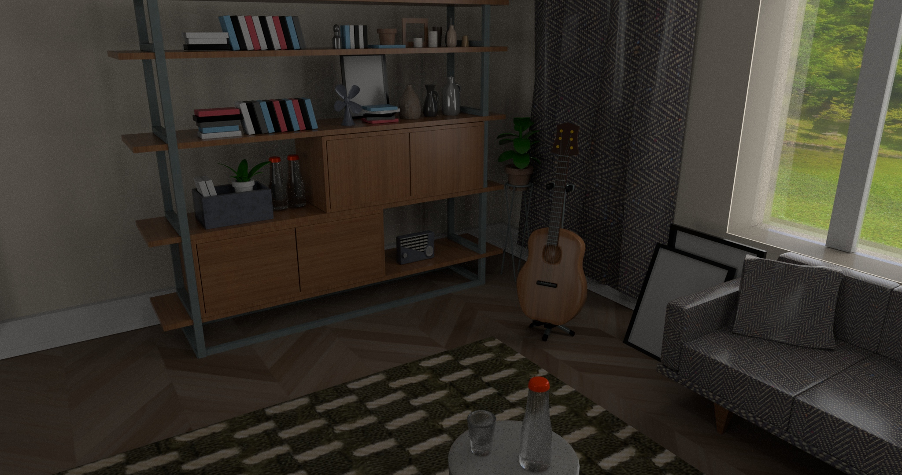
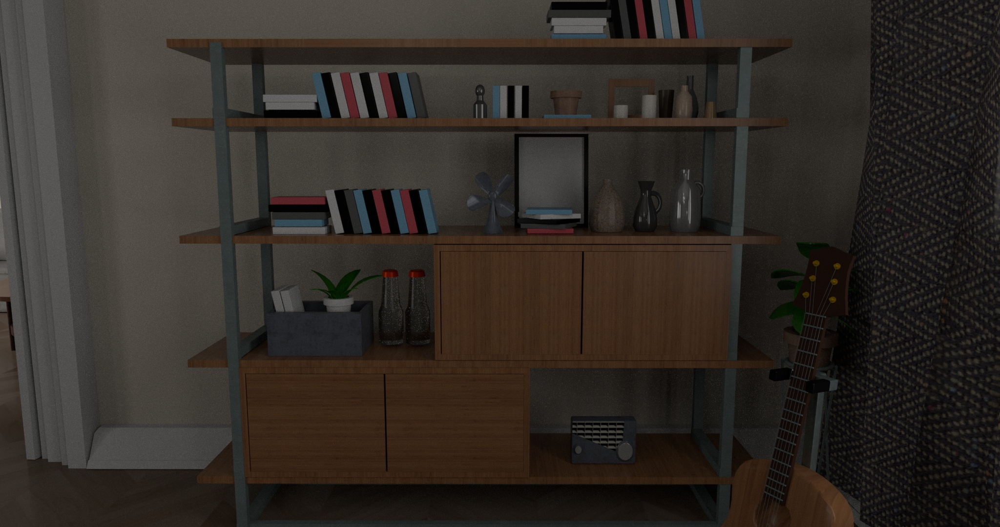

# 3D Room Replica (Autodesk Maya)

## Overview
This project was completed as part of learning Autodesk Maya and the fundamentals of 3D modeling. Using only reference images of a real-world room, I recreated the environment by modeling each object individually and assembling them into a complete 3D scene.
Throughout this project, I gained hands-on experience with the complete 3D asset creation workflow, including polygon modeling, UV mapping, texturing, material creation, and applying normal maps. Recreating an existing room challenged me to accurately match proportions, scale, and layout while developing an understanding of industry-standard modeling practices.

## Model Pictures

## Objectives
- Learn the fundamentals of 3D modeling in Autodesk Maya.
- Recreate a real-world room using reference images.
- Develop a complete workflow from modeling to texturing.
- Practice creating clean, organized, and efficient 3D assets.

## Tools Used
- Autodesk Maya

## Skills Developed
### 3D Modeling
- Polygon modeling
- Extrusions
- Beveling
- Loop cuts
- Face, edge, and vertex editing
- Move, Rotate, and Scale transformations
- Reference-based modeling
- Object scaling and proportions
### Asset Creation
- UV unwrapping and UV mapping
- Material creation
- Texture mapping
- Applying normal maps
### Best Practices
- Clean topology
- Quad-based modeling
- Polygon optimization
- Scene organization
- Attention to detail
- Spatial reasoning

## Development Process
1. Gathered reference images of the room.
2. Blocked out the overall room dimensions and layout.
3. Modeled walls, furniture, and decorative objects using polygon modeling techniques.
4. Refined geometry using extrusions, bevels, loop cuts, and vertex editing.
5. Created UV maps for each asset.
6. Applied materials, textures, and normal maps to improve realism.
7. Arranged the completed assets to closely match the original room.
8. Reviewed and refined the scene through multiple iterations.

## What I Learned
This project served as my introduction to Autodesk Maya and the core principles of 3D modeling. Starting with simple primitive shapes, I learned how to transform them into detailed objects using essential modeling techniques such as extrusions, bevels, loop cuts, and polygon editing.

I became comfortable using Maya's transformation tools—including moving, rotating, and scaling objects—to build accurate models while maintaining proper proportions throughout the scene. Working directly with vertices, edges, and faces gave me a better understanding of how geometry is constructed and refined.  

As the project progressed, I learned the importance of clean topology by creating efficient polygon layouts, minimizing unnecessary geometry, and primarily using quad-based meshes. This helped me understand how topology affects both model quality and future editing.  

Beyond modeling, I learned the complete workflow for preparing assets by creating UV maps, applying textures and materials, and using normal maps to add realistic surface detail without increasing polygon count.  

Overall, this project provided a strong foundation in the fundamental concepts and workflows used in 3D environment creation and significantly improved my confidence using Autodesk Maya.

## Challenges
Because the project relied entirely on reference images, estimating object dimensions, proportions, and placement required careful observation and repeated refinement. Matching the appearance of real-world materials through UV mapping and texturing also required experimentation and attention to detail.

## Key Takeaways
- Built a complete 3D environment from real-world reference images.
- Learned the fundamentals of Autodesk Maya and polygon modeling.
- Developed experience with UV mapping, texturing, materials, and normal maps.
- Applied clean topology and efficient modeling practices.
- Gained practical experience following a complete 3D asset creation workflow from concept to finished scene.
